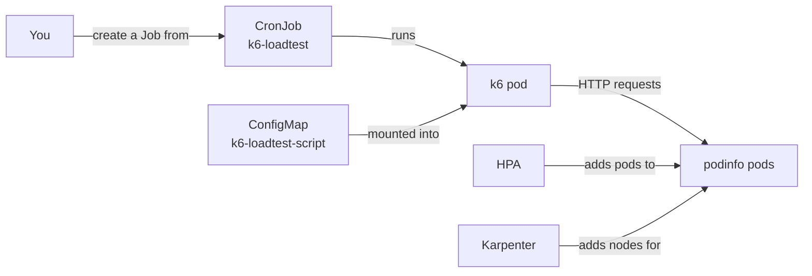
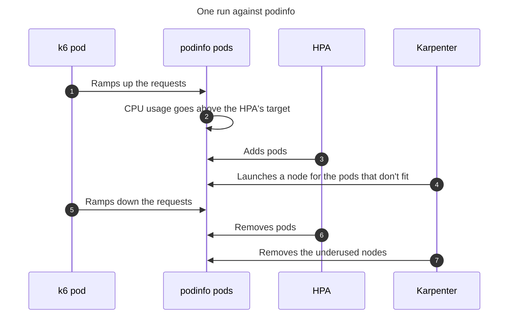

{/* This doc is aggregated into the EKS Forge documentation site: https://eks-forge.readthedocs.io/latest/. It is not meant to be read directly in this repository. */}
# How Load Testing Works

A load test sends synthetic requests to an app, to see how it holds and scales before real users find out for you. EKS Forge ships one for podinfo, built with [k6](https://grafana.com/docs/k6/latest/). This page explains how it's built, and why.
For the steps to load test your own app, see [Load Test an Application](/docs/applications/load-testing/load-test-an-application/).

## What a Load Test Is Made Of
A load test is three files, next to the app they target (see [`manifests/podinfo/`](../manifests/podinfo/)):
- A `ConfigMap` holding the k6 script, which says what to request and how hard.
- A suspended `CronJob`, which runs k6 with that script when you trigger it.
- A `CiliumNetworkPolicy`, which lets the k6 pod reach the app.

They only generate the load. What reacts to it is the app's [HorizontalPodAutoscaler](https://kubernetes.io/docs/concepts/workloads/autoscaling/horizontal-pod-autoscale/) (HPA), which adds pods as the load grows, and [Karpenter](https://karpenter.sh/), which adds nodes for them.

## Why k6 Runs Inside the Cluster
k6 runs as a pod, and calls the app's [`Service`](https://kubernetes.io/docs/concepts/services-networking/service/) by its cluster DNS name, like `podinfo.podinfo.svc.cluster.local`. The app needs no hostname, a private app needs no [Tailscale](/docs/security/tailscale/) connection, and the load doesn't depend on your machine or its network.

The k6 pod runs on the [`elastic` NodePool](/docs/compute/how-pods-are-scheduled/#elastic-nodepool), like podinfo. Karpenter launches a node for it if none has room, and removes it after the run.

The trade-off is what the load skips. A user's request goes through the gateway and its load balancer before it reaches the app, and k6's doesn't. A run tells you how the app and its autoscaling behave, not how the whole path does.

## Why a Suspended CronJob
A load test should run when you ask for it, not when it's deployed. A plain [`Job`](https://kubernetes.io/docs/concepts/workloads/controllers/job/) in git does the opposite: it runs once, as soon as ArgoCD syncs it, in every environment the app of apps repository deploys to. And running it again means deleting it first, so ArgoCD recreates it.

So k6 is declared as a [`CronJob`](https://kubernetes.io/docs/concepts/workloads/controllers/cron-jobs/) with `suspend: true`, in [`manifests/podinfo/k6-loadtest-cronjob.yaml`](../manifests/podinfo/k6-loadtest-cronjob.yaml). A suspended `CronJob` never starts anything on its own: its `schedule` is required, but ignored. It only serves as a template, which `kubectl create job --from` copies into a `Job` each time you want a run.

A failed run isn't retried. Its `backoffLimit` and `restartPolicy` are set so that a k6 pod that fails stays failed, so the app never receives a second wave of load nobody asked for.

## The Script Lives in a ConfigMap
The script is a key of a `ConfigMap`, mounted into the k6 pod as a file. The pod runs the stock [`grafana/k6`](https://hub.docker.com/r/grafana/k6) image, so there's no image to build or push, and changing the load is a git change like any other.

podinfo's script, in [`manifests/podinfo/k6-loadtest-script.yaml`](../manifests/podinfo/k6-loadtest-script.yaml), uses k6's [`ramping-vus` executor](https://grafana.com/docs/k6/latest/using-k6/scenarios/executors/ramping-vus/). It ramps the number of virtual users up, each requesting podinfo in a loop, then back down, over a few minutes. One run then shows the app scaling up and scaling back down.

## What the Load Triggers
podinfo's HPA, in [`manifests/podinfo/podinfo-hpa.yaml`](../manifests/podinfo/podinfo-hpa.yaml), keeps the average CPU usage of podinfo's pods at a target share of their CPU `requests`. It reads the usage from [metrics-server](https://github.com/kubernetes-sigs/metrics-server), and adds or removes pods to get back to that target, between its minimum and maximum number of replicas.

Pods need nodes. When a new pod doesn't fit on the existing `elastic` nodes, Karpenter launches one for it. When the load drops, the HPA removes the pods, and Karpenter removes the nodes left underused.

The `Deployment` sets no `replicas`. The HPA owns that field, and ArgoCD reverts whatever drifts from git: with a number in the manifest, each sync would set the replicas back to it, against the HPA.

The HPA also scales down faster than the default. Kubernetes waits for several minutes of lower usage before it removes pods, and podinfo's HPA shortens that wait, so a run shows the scale down without it. It's a demo setting: a real app usually keeps the default, so a short dip in traffic doesn't remove pods it needs a minute later.

## Network Policies
podinfo's namespace denies all traffic by default, so k6's requests are dropped unless both ends allow them (see [Why Both Ends Need a Rule](/docs/security/how-network-policies-work/#why-both-ends-need-a-rule)). k6 has its own policy, [`manifests/podinfo/k6-loadtest-network-policy.yaml`](../manifests/podinfo/k6-loadtest-network-policy.yaml), which allows egress to podinfo. And [`manifests/podinfo/podinfo-network-policy.yaml`](../manifests/podinfo/podinfo-network-policy.yaml) allows ingress from k6.

k6 also resolves the `Service` name. It runs in the app's namespace, which [`kube-dns-egress.yaml`](../manifests/network-policies/cluster-wide/kube-dns-egress.yaml) already lists, so it needs no DNS rule of its own.
