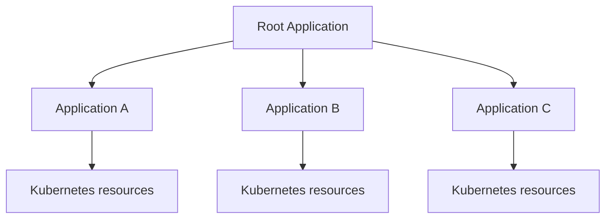
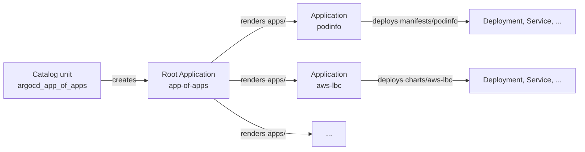
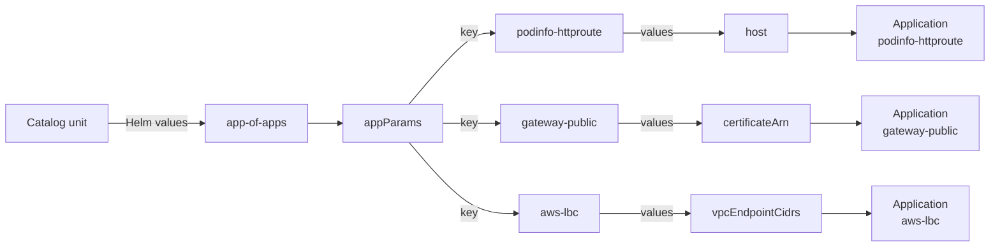
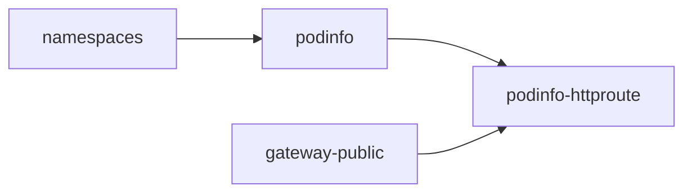

{/* This doc is aggregated into the EKS Forge documentation site: https://eks-forge.readthedocs.io/latest/. It is not meant to be read directly in this repository. */}
# How the App of Apps Works

The [app of apps repository](https://github.com/ConsciousML/argocd-app-of-apps-template) holds everything [ArgoCD](https://argo-cd.readthedocs.io/en/stable/) deploys inside your cluster, from controllers like the AWS Load Balancer Controller to your own applications. This page explains why it's structured the way it is.

## What Is the App of Apps Pattern
ArgoCD deploys Kubernetes resources through [Applications](https://argo-cd.readthedocs.io/en/stable/core_concepts/): each one points at a path in a git repository and keeps the cluster in sync with it. An Application is itself a Kubernetes resource, so an Application can deploy other Applications.

The [App of Apps pattern](https://argo-cd.readthedocs.io/en/stable/operator-manual/cluster-bootstrapping/#app-of-apps-pattern-alternative) builds on this. You create a single root Application, and it deploys the Applications of every other component from git. The cluster's whole application set then lives in one repository, and adding or removing an application is a git change.



## The Root App and Its Children
Here's how EKS Forge applies this pattern in the app of apps repository.



Terraform creates the root Application, `app-of-apps`, with the rest of the cluster. It points at the [`apps/`](../apps/) Helm chart, which renders one child Application per entry under `applications` in [`apps/values.yaml`](../apps/values.yaml). Each child then deploys the manifests or chart at its entry's `path`.

From then on, ArgoCD deploys every application from the app of apps repository. Adding an application is one entry in `apps/values.yaml`, with no Terraform change unless the application needs AWS resources.

A child Application is an entry, not a directory. Several entries can share one chart with different values: every `*-httproute` entry deploys [`charts/gateway-api/httproute`](../charts/gateway-api/httproute/), each with its own values file.

## Who Owns What
Two repositories deploy what runs in your cluster:
- The [catalog](https://github.com/ConsciousML/terragrunt-template-catalog-eks) owns the AWS resources (IAM roles, Pod Identity associations, secrets, certificates, etc.), the root Application, and every value only Terraform knows.
- The app of apps repository owns the charts, the manifests, the list of Applications, and their default values.

This split keeps each change in one place. An application change ships through ArgoCD without a Terraform apply. And values that depend on the deployment, like a certificate ARN or a hostname, never get hardcoded in the app of apps repository: the catalog injects them at deploy time.

The catalog also injects the repository URL and git revision every child Application syncs from. So the catalog's `github.hcl` and the environment's revision are the only places that decide which fork and which version a cluster runs.

## `appParams` Injection
The catalog passes values to child Applications through a single map, `appParams`:



The [`argocd_app_of_apps` unit](https://github.com/ConsciousML/terragrunt-template-catalog-eks/blob/main/units/eks/addons/argocd/app_of_apps/terragrunt.hcl) sets `appParams` as a Helm value on the root Application. For each entry in `apps/values.yaml`, [`apps/templates/applications.yaml`](../apps/templates/applications.yaml) looks up `appParams.<name>` and passes it to the child as its Helm values.

`appParams` is a map. Each key is an Application's `name`, and it maps to the Helm values that Application receives. For example, the catalog gives `podinfo-httproute` its hostname:
```hcl
appParams = {
  "podinfo-httproute" = {
    host = local.domain_public_podinfo
  }
  ...
}
```

Keying by `name` instead of `path` lets two Applications sharing a chart get different values. [`apps/values.schema.json`](../apps/values.schema.json) lists every allowed key, so a typo fails loudly instead of injecting values that nothing reads.

Only values Terraform owns belong in `appParams`: ones that come from an AWS resource or differ per deployment, like a certificate ARN, a hostname, or a secret name. Everything static stays a default in the app of apps repository, versioned with the chart that reads it.

## Environment Overlays
The same app of apps repository deploys the applications of `dev`, `staging`, and `prod`. When an Application needs a different config per environment, it loads an overlay file on top of its chart's `values.yaml`:
```yaml
  - name: loki
    path: charts/monitoring/loki
    ...
    extraValueFiles:
      - charts/monitoring/loki/values-{{ .Values.global.environment }}.yaml
```

The catalog injects `global.environment` into the root Application, and `applications.yaml` renders each `extraValueFiles` entry with it. In `prod`, `loki` loads [`values-prod.yaml`](../charts/monitoring/loki/values-prod.yaml), which keeps its storage volumes when Loki is deleted or scaled down. `values-dev.yaml` and `values-staging.yaml` delete them instead, to save costs.

An overlay holds only the keys that differ, so the shared config lives once in `values.yaml` instead of being copied per environment. And since [`apps/values.schema.json`](../apps/values.schema.json) requires a non-empty `global.environment`, a missing environment fails loudly instead of silently loading a nonexistent `values-.yaml`.

## Sync Waves
Some Applications can't start before others. Take podinfo: its pods need the `podinfo` namespace, and its route to the internet needs both podinfo and the public gateway.



Each entry in `apps/values.yaml` has a `syncWave` number that encodes this order.

The root Application syncs its children one [sync wave](https://argo-cd.readthedocs.io/en/stable/user-guide/sync-waves/) at a time, lowest number first. It only starts the next wave once every Application in the current one is healthy.

For example, if `namespaces` is at wave `0` and `podinfo` at wave `1`, ArgoCD syncs `namespaces`, waits for it to be healthy, then syncs `podinfo`.

## Namespaces
[`apps/templates/applications.yaml`](../apps/templates/applications.yaml) sets `CreateNamespace=false` on every child Application, so none of them can create its own namespace. Instead, the `namespaces` Application creates them all from [`manifests/namespaces`](../manifests/namespaces/), each with its [security](/docs/security/) labels.

This way, no application can end up in a namespace without those labels. An application whose namespace is missing from `manifests/namespaces` fails to sync instead.

## Deletion Safety
Git decides what gets deleted. Remove a manifest or an Application from the app of apps repository, and ArgoCD removes what it deployed from the cluster. Nothing lingers after you drop an application.

Namespaces are the exception. Deleting one deletes everything inside it, ArgoCD's own namespace included, so a single wrong commit could wipe out the cluster. ArgoCD never deletes a namespace on its own: removing one takes a deliberate action.

## Versioning per Environment
Each environment decides which version of the app of apps repository it runs:
- `dev` follows a branch, `main` by default. You can point it at your own branch to try a change before merging it.
- `staging` and `prod` pin a git tag in the [live repository](https://github.com/ConsciousML/terragrunt-template-live-eks), so they only run versions you released and tested.

This tag is separate from the catalog's version. An application change ships without a new catalog release, and a catalog change ships without touching the applications. The trade-off is that both versions must stay compatible: every `appParams` key the catalog sends must exist in the app of apps version it deploys.
